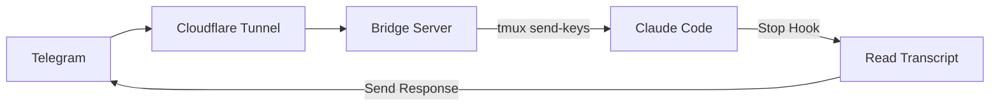

# claudecode-telegram


Telegram bot bridge for Claude Code. Send messages from Telegram, get responses back.

## How it works



1. Bridge receives Telegram webhooks, injects messages into Claude Code via tmux
2. Claude Code's Stop hook reads the transcript and sends response back to Telegram
3. Only responds to Telegram-initiated messages (uses pending file as flag)

## Quick Start

```bash
git clone https://github.com/hanxiao/claudecode-telegram
cd claudecode-telegram

# Create .env
cp .env.example .env  # or create manually:
# TELEGRAM_BOT_TOKEN=your_token_here
# PORT=8090

# Run setup (installs systemd services + hot reload)
./setup.sh
```

## Setup

### 1. Create Telegram bot

Message [@BotFather](https://t.me/BotFather) on Telegram, create a bot, and get the token.

### 2. Configure hooks

The Stop hook sends Claude's response back to Telegram. The PostToolUse hook sends progress updates (optional).

```bash
# Copy hooks
cp hooks/send-to-telegram.sh ~/.claude/hooks/
cp hooks/notify-tool-use.sh ~/.claude/hooks/
chmod +x ~/.claude/hooks/*.sh
```

Add to `~/.claude/settings.json`:
```json
{
  "hooks": {
    "Stop": [
      {"hooks": [{"type": "command", "command": "~/.claude/hooks/send-to-telegram.sh"}]}
    ],
    "PostToolUse": [
      {"hooks": [{"type": "command", "command": "~/.claude/hooks/notify-tool-use.sh"}]}
    ]
  }
}
```

### 3. Configure environment

```bash
cat > .env << 'EOF'
TELEGRAM_BOT_TOKEN=your_token_here
PORT=8090
EOF
```

### 4. Run setup

```bash
./setup.sh
```

This will:
- Install systemd user services (bridge, cloudflare tunnel, file watcher)
- Enable auto-start on boot
- Enable hot reload (bridge restarts when `bridge.py` or `hooks/` change)
- Enable lingering (services survive SSH logout)

### 5. Expose via Cloudflare Tunnel

```bash
cloudflared tunnel --url http://localhost:8090
```

Or configure a named tunnel for a persistent URL.

### 6. Set webhook

```bash
curl "https://api.telegram.org/bot${TELEGRAM_BOT_TOKEN}/setWebhook?url=https://YOUR-TUNNEL-URL"
```

## Bot Commands

### Core
| Command | Description |
|---------|-------------|
| `/stop` | Interrupt Claude (sends Escape) |
| `/screenshot` | Capture tmux screen |
| `/status` | Show project, branch, cwd, state |
| `/scroll [n]` | Show last n lines of output |

### Session Management
| Command | Description |
|---------|-------------|
| `/sessions` | List all tmux sessions |
| `/attach <name>` | Switch to a tmux session |
| `/start [name] [dir]` | Create new tmux session + start Claude |
| `/restart` | Restart Claude (offers resume button) |
| `/new [dir]` | Start fresh Claude session |
| `/resume` | Pick from recent sessions (inline keyboard) |
| `/continue_` | Continue most recent session |
| `/kill` | Kill current tmux session |
| `/clear` | Clear conversation |

### Quick Replies
| Command | Description |
|---------|-------------|
| `/y` `/n` `/ok` `/retry` | Send quick responses |
| `/pick N` | Select option N from interactive prompt |

### Actions
| Command | Description |
|---------|-------------|
| `/commit` | Send /commit to Claude |
| `/undo` | Send /undo to Claude |
| `/diff` | Show git diff |
| `/loop <prompt>` | Run prompt in a loop |
| `/pwd` | Show current directory |

### Settings
| Command | Description |
|---------|-------------|
| `/verbose on\|off` | Toggle tool-use progress notifications |
| `/coauthor on\|off` | Toggle Co-Authored-By in commits |
| `/signature on\|off` | Toggle "Generated with Claude" signatures |

## Features

- **Interactive prompts**: Claude's `AskUserQuestion` prompts appear as Telegram inline buttons
- **Photo support**: Send photos (including albums) — they're downloaded and passed to Claude
- **Resume sessions**: `/restart` captures the session ID and offers a "Resume previous" button
- **Multi-session**: Use `/sessions` and `/attach` to switch between tmux sessions
- **Hot reload**: Edit `bridge.py` or `hooks/` and the bridge restarts automatically via systemd path watcher
- **Progress updates**: Enable `/verbose on` to see real-time tool usage notifications

## Environment Variables

| Variable | Default | Description |
|----------|---------|-------------|
| `TELEGRAM_BOT_TOKEN` | required | Bot token from BotFather |
| `PORT` | `8080` | Bridge HTTP server port |
| `TMUX_SESSION` | `claude` | Default tmux session name |
| `UPLOAD_DIR` | `~/uploads` | Directory for downloaded photos |

## Systemd Services

Managed via `./setup.sh`. Service files are in `systemd/`.

| Service | Description |
|---------|-------------|
| `telegram-bridge.service` | The bridge HTTP server |
| `cloudflared.service` | Cloudflare tunnel |
| `telegram-bridge-watcher.path` | Watches for file changes (hot reload) |
| `telegram-bridge-watcher.service` | Restarts bridge on file change |

```bash
# Useful commands
systemctl --user status telegram-bridge      # Check status
systemctl --user restart telegram-bridge     # Manual restart
journalctl --user -u telegram-bridge -f      # Live logs
systemctl --user stop telegram-bridge-watcher.path   # Disable hot reload
```

## File Structure

```
bridge.py              # Main bridge server
hooks/
  send-to-telegram.sh  # Stop hook — sends response to Telegram
  notify-tool-use.sh   # PostToolUse hook — progress notifications
systemd/               # Systemd service files
setup.sh               # One-command setup script
.env                   # Environment config (not committed)
```
